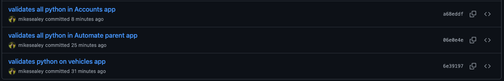

# ci_pp3

## Lighthouse Reports and Validation
### Performance

### Accessibility

### Code Validation

#### Python Validation
I've used a VSCode extension called Flake8 (v2025.2.0) in order to validate my Python code. There are a couple of occasions where lines exceed the reccomended 80 characters, such as the API endpoint for checking vehicle registration numbers (VRNs) but outside of that, everything else passes.



#### JavaSccript Validation


### Code Documentation


## Useful resources
coolors.co - colour pallette picker

## Credits
Background image by Malte Luk https://www.pexels.com/photo/man-fixing-vehicle-engine-2244746/

UK Rear number plate is colour #ffd800 with dimensions 520mm 111mm
https://assets.publishing.service.gov.uk/media/6694e379fc8e12ac3edafc60/inf104-vehicle-registration-numbers-and-number-plates.pdf More writings on Number Plate Sizing Dimensions

Bootstrap Modal https://getbootstrap.com/docs/4.0/components/modal/
Adding in Bootstrap part way through this project was an awful decision and I should 100% have brought it in earlier or not at all

https://stackoverflow.com/questions/209029/best-way-to-remove-an-event-handler-in-jquery
Useful for removing an on(click) handler

Regarding "Deleting" a vehicle from a user - 
The vehicle is never actually deleted, only the relationship is removed. This helps to maintain a broader picture of the vehicle's history, should the car be sold from one user to another.
In order to reflect the change (vehicle "deleted") I could re-fetch the data from the database, which would reflect the vehicle being "deleted", but it may be better to simply save the "deletion" and then just not render it on the front-end. This would make things easier for users with poor connections.

Some writing on Optimistic vs Pessimistic rendering: https://medium.com/@whosale/optimistic-and-pessimistic-ui-rendering-approaches-bc49d1298cc0 and https://blog.devgenius.io/a-quick-look-at-optimistic-vs-pessimistic-rendering-4df00a5af0ff

Had to write a clearForm function - if the user went from looking at an ICE vehicle to an electric vehicle the engine capacity remained because it was not overwritten.

Some example VRNs for testing
MM71UOS - Peugeot Electric

Useful for validating VRN formats: https://www.belinus.co.uk/plates-format-history.php


Database structure forces rethink - 
When a user deletes a vehicle (for example, if they no longer own the vehicle) We don't actually delete the vehicle from the database, we simply update it to have no user-relationship.

The downside of doing it this way is that should another user buy that vehicle and try to register it, they're trying to create a new row in the database where vrn (vehicle registration number) is the ID, which must be unique.

Some frontend-validation is required to check if the car already exists in the database, and if it has no user associated with it. There are cases where someone may sell the vehicle but fail to update their account, and a different user buys that vehicle they won't be able to save the vehicle to themselves. In such cases it may worth building some sort of back-office admin panel for staff.

Update: This could be solved with a many-to-many relationship between vehicles and users - providing booking details were filtered to current user, it would maintain the data integrity but allow someone to register their newly-purchased second hand vehicle even if it's previous owner has still got it registered with their account.

CREDITS:
Boostrap
Toast notification from docs https://getbootstrap.com/docs/4.5/components/toasts/

Interesting bugs:
Because much of the dom is being manipulated, I had to change teh way they're applied 
Swapping $("#thing").on("click", function(){}) for $("#parent-thing").on("click", "#thing", function(){}) where the parent "thing" should always be present.

tripping point: 
JS booleans and Python booleans are not comparable - Django returns a True or False, which I want to compare with JS true or false
True =/= true and False =/= false
in fact, when simply checking if (knownFalsePython) for truthiness, False will return true, because it equates to a string

icons for service types


stumbled aacrrs View Decorators - https://docs.djangoproject.com/en/5.1/topics/http/decorators/ - basically allows you to set/restrict/ to specific methods for views. Limits the DELETE BOOKING to a POST which comes with the positive confirmation of "Yes, I'm sure I want to delete this booking"

issues setting the datetime-local element with the saved value in the input form
https://stackoverflow.com/questions/30166338/setting-value-of-datetime-local-from-date

Mobile Navbar tutorial
https://www.youtube.com/watch?v=iJRZi_OdlPE

Automating Emails tutorial
https://www.youtube.com/watch?v=1BaLWYUO1k4

Fun(!) Bug 
```JS
$.ajax({
        url: `/bookings/${bookingData.bookingId}/complete/`,
        type: "PUT",
        contentType: "application/json",
        headers: {
            "X-CSRFToken": getCSRFToken(),
        },
        data: JSON.stringify({
            mechanicsNotes: mechanicsNotes
        }),
        success: function(response) {
            console.log("Booking marked complete:", response);
            refreshAllBookingList();
            showToastNotification("Success", "Mechanic's notes saved and booking marked complete.");
            $("#multi-purpose-modal").modal("hide");
            // Clear the booking from the left block (or at least remove the form)
            // console.log("Done, and now going to display the booking data!")
            // displayBooking(bookingData)
            // Wont work! Because that's going to overwrite it with the data from before the mehcanics notes were saved
            // Optimistically render these instead, 
            $("#mechanics-notes-input").replaceWith($("<div>", { id: "mechanics-notes-view", text: bookingData.mechanics_notes || "No mechanics notes provided" }))
            // $("#mechanics-notes-view").val(mechanicsNotes)
        },
        error: function(xhr, status, error) {
            console.error("Failed to save mechanic's notes:", error);
            showToastNotification("Error", "Failed to save mechanic's notes.");
            // Sad Toast
        }
    });
```

Interesting Bug - Function from elsewhere in the code by the same name was getting called instead of one in the file
Had to rename displayBooking in all_bookings.js to displayCustomerBooking to combat this.


Code from w3school scrollbar https://www.w3schools.com/howto/howto_css_custom_scrollbar.asp


jquery mimic a click with https://api.jquery.com/click/

Bootstrap 5.0 (had to upgrade)
"Offcanvas" - (aka sidepanel for mobile navigation)