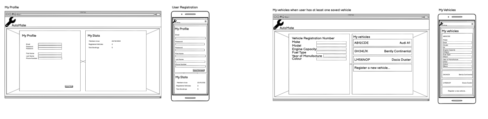
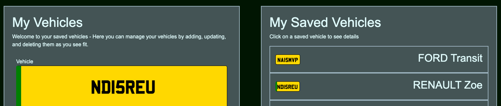
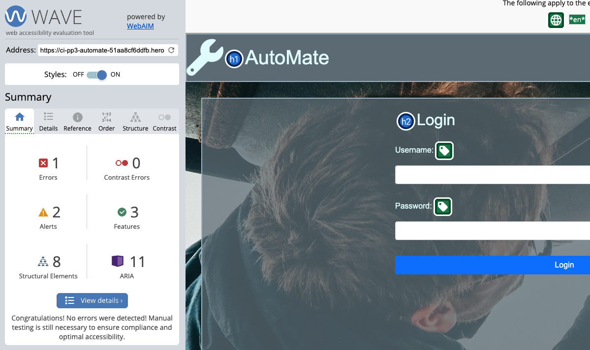
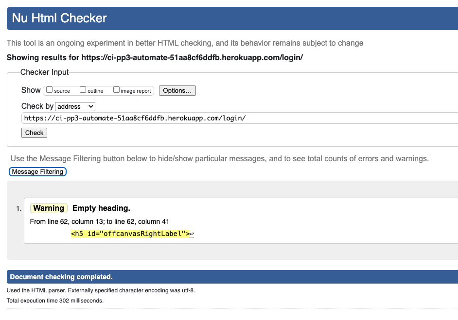
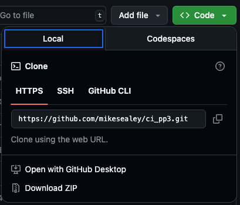
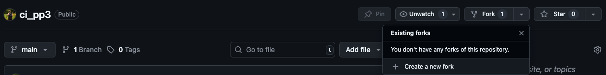

# AutoMate

This project is an booking site for automotive service, inspection, and repair, as part of my Level 5 Diploma in Web Application Development.

This project is for educational purposes only. No services will be rendered.

## About AutoMate
With Automate, users can create an account and log in. From there, users can add vehicles to their profile and use those vehicles to create bookings for [MOT Tests](https://en.wikipedia.org/wiki/MOT_test), services, repair work, or other general bookings.

A feature of the "My Vehicles form is the Vehicle Registration Number API which ties into the official UK Driver and Vehicle Licencing Agency (DLVA) API key to get details of this vehicle. This ensures mechanics know specifically the type of vehicle to expect in the booking, as well as helping the user to provide valid information.

AutoMate also features a back-office section, specifically for staff-members, who can accept bookings from customers, and carry out services. When a booking has been completed, details of the booking are automatically emailed to the customer, so that they know the specifics of the service, and that their car is ready for collection.$

## User Stories

### As a user...
* I can log in so that I can manage my bookings, vehicles, and details
* I can save a vehicle to My Vehicles
* I can create a booking for an MOT
* I can create a booking for a Service
* I can create a booking for a repair
* I can create a general booking
* I can recieve updates about my booking via email

### As a Staff Member...s
* I can see a list of all bookings with their type and status
* I can approve incoming bookings
* I can carry out bookings and save notes on them

## Design Considerations
I've created a wireframe with Balsamiq, which can be found at the base-level of this repository.

A big part of the considerations were that this should be available to both customer and staff-user as mobile/tablet/desktop friendly. There's a high likelihood that the customer would use this to book a service from their phone, an office staff member may use a desktop to accept the booking, and a mechanic may be using a tablet in the workshop to make notes on the booking while carrying out the service/MOT test.

With this in mind, I've built most of the project in these reusable blocks, which appear side-by-side on large devices, and in a column on smaller screens.

I used [https://coolors.co/](https://coolors.co/) to choose a pallette which can be seen in style.css, though I have stuck with the standard Bootstrap colours for CTA buttons, which I feel makes them more prominent.

I've also made sure to add a green flash for the numberplate of any Electric Vehicles.  Whilst it's not a requirement that EVs in the UK display this green flash, it is often worn with pride. This goes on top of a standard UK Rear number plate colour #ffd800.
 

Regarding "Deleting" a vehicle from a user - 
The vehicle is never actually deleted, only the relationship is removed. This helps to maintain a broader picture of the vehicle's history, should the car be sold from one user to another.
In order to reflect the change (vehicle "deleted") I could re-fetch the data from the database, which would reflect the vehicle being "deleted", but it may be better to simply save the "deletion" and then just not render it on the front-end. This would make things easier for users with poor connections.

#### Interesting tripping point:
JS booleans and Python booleans are not comparable - Django returns a `True` or `False`, which I want to compare with JS `true` or `false`
`True =/= true` and `False =/= false`
in fact, when simply checking if `known_false_python_variable` for truthiness, `False` will return `true`, because it equates to a string

## Lighthouse Reports and Validation
### Performance
For Performance tests, I've run each page through Chrome's Lighthouse tests.

### Accessibility
I've used the [Web Accessability Evaluation tool (WAVE)](https://wave.webaim.org/) to check the accessibility of my project.

There are a couple of things that it throws an error over - one of which is a "Skipped Heading Level" issue. This is for people using Screen Readers, where Headings h1-h6 denote importance. I'm not completely sure why this error is thrown, as the page contains an h1 for the title in the nav bar, followed by an h1 and h2 accordingly in the main body of the page.

I also had an error for an Empty Heading - this was because I was _always_ rendering the heading, and only conditionally rendering text inside it. [This commit](https://github.com/mikesealey/ci_pp3/commit/eec949f7b88ba0ff4a1cd9153d01cac1e4583761) handles it by moving the entire heading inside the if-statement, rather than having the if-statement inside the heading.

### Code Validation
#### Python Validation
I've used a VSCode extension called Flake8 (v2025.2.0) in order to validate my Python code. There are a couple of occasions where lines exceed the reccomended 80 characters, such as the API endpoint for checking vehicle registration numbers (VRNs) but outside of that, everything else passes.

#### JavaScript Validation
I've used jshint.com to validate my JS. It doesn't return any errors, though it does warn me about the following things
* `const` an `let` being specific to ES6
* Template literal being specific to ES6
* Missing colons, though they are entirely useless
* Arrow notation in functions being specific to ES6

It's also totally unsure of how to handle jQuery and throws many warnings about anything `$`related. There are also a couple of things surrounding the Bootstrap sidepanel that get warned as "declared but never read" but on closer inspection these variables are "declared but never read _in this particular file_".

##### all_bookings.js

##### bookings.js

#### common.js

#### vehicles.js

### HTML Validation
I have validated my HTML using https://validator.w3.org/nu/ - some pages were validated based on their web-address (ie feeding the live version of the site into the validator) though for logged-in pages this isn't possible, so other pages were fed into the validator in plain-html instead.

#### Homepage
There are a couple of reccuring issues that it flags - There's an h5 that contains a greeting to the logged in user, though the user is not always logged in, so there are occasions when the h5 tag is empty.

#### Log In

#### Signup
The Signup form uses Django's baked-in form, which brings with it a handful of things that this HTML checker isn't happy about, though this isn't actually code I've written.

### Code Documentation
### Browser Compatibility
Through warning thrown during Code Validation it is clear that this project is unlikely to be fully compatable with any pre-ES6 browsers, though as ES6 was introduced a decade ago, I'm happy for this to be where the line is drawn. I've tested thoroughly on Chrome, Firefox, and Safari.

## Testing User Stories

_NB: In order to test, you may wish to visit AutoTrader.co.uk for a good resource of valid UK VRNs_

-------
### As a user...
* I can log in so that I can manage my bookings, vehicles, and details
### Steps to test
- attempt to log in with valid user credentials
### Result
- pass - Nav Bar shows options like "My Profile", "My vehicles", and "My Bookings"
-------
### As a user...
* I can save a vehicle to My Vehicles
### Steps to test
- Log in with valid user credentials
- visit "My Vehicles
- provide valid UK Vehicle Registration Number, and search for VRN details
- provide any missing vehicle details
- click save vehicle
### Result
- pass - My Saved Vehicles list updates with the new vehicle.

----
### As a user...
* I can create a booking for an MOT/Service/Repair/General Booking
### Steps to test
- From an account that contains at least one vehicle, visit My Bookings
- Click "Add new booking"
- Select a booking type, a vehicle, a date, provide customer notes and vehicle mileage at service 
- click _Save Booking_
### Result
- pass - boookings list is refreshed and updated.

-----
### Multiple User/Staff stories in one test
- As a user...I can recieve updates about my booking via email
- As a Staff Member...I can see a list of all bookings with their type and status
- As a Staff Member...I can approve incoming bookings
- As a Staff Member...I can carry out bookings and save notes on them

### Steps to test
- From an account that contains at least one vehicle, visit My Bookings
- Click "Add new booking"
- Select a booking type, a vehicle, a date, provide customer notes and vehicle mileage at service 
- click _Save Booking_
### Result
- pass - Email is sent confirming that AutoMate has recieved my booking, and is awaiting aproval.
### Aditional steps: 
- Log in from a _Staff-Status_ account
- Visit "Customer Bookings"
- Approve the booking - Confirmation email will be sent
### Result
- Pass "Your booking as been approved" email recieved
### Additional Steps
- Log in from a _Staff-Status_ account
- Visit "Customer Bookings"
- Click on the booking and click "Carry out service"
- Provide "Mechanics Notes" - ie details of the work carried out
- click "Save"
- click "Save notes in confirm modal"
### Result
- pass - recieve "Your automate booking has been completed" with notes from the mechanic

## Deployment

### Cloning This Repo

You may wish to clone this repo to work on it yourself.

- At the top of the page above the file-list, click the "Code" button
- Copy the URL `https://github.com/mikesealey/ci_pp4.git`
- On the command line, navigate to where you want to clone this repository
- run the following command
  `git clone https://github.com/mikesealey/ci_pp4.git`
- `cd` into the folder, and then run `npm i` to install all dependancies

  

### Forking This Repo
You may also wish to fork this repo to develop it further for your own needs

- In the top bar, click "Fork"
- Choose the github account or organisation where you want to fork the repository
- Github will now create a copy (or _fork_) of the repository in your account.

## Useful resources & Credits
 - coolors.co - colour pallette picker
- Background image by Malte Luk https://www.pexels.com/photo/man-fixing-vehicle-engine-2244746/
https://assets.publishing.service.gov.uk/media/6694e379fc8e12ac3edafc60/inf104-vehicle-registration-numbers-and-number-plates.pdf
- More writings on Number Plate Sizing Dimensions
- View Decorators - https://docs.djangoproject.com/en/5.1/topics/http/decorators/ - basically allows you to set/restrict/ to specific methods for views. Limits the DELETE BOOKING to a POST which comes with the positive confirmation of "Yes, I'm sure I want to delete this booking"
- issues setting the datetime-local element with the saved value in the input form https://stackoverflow.com/questions/30166338/setting-value-of-datetime-local-from-date
- Mobile Navbar tutorial -https://www.youtube.com/watch?v=iJRZi_OdlPE
- Automating Emails tutorial - https://www.youtube.com/watch?v=1BaLWYUO1k4
- Code from w3school scrollbar https://www.w3schools.com/howto/howto_css_custom_scrollbar.asp
- jQuery mimic a click with https://api.jquery.com/click/
- Bootstrap 5.0 (had to upgrade)
- "Offcanvas" - (aka sidepanel for mobile navigation)
- Bootstrap Modal https://getbootstrap.com/docs/4.0/components/modal/
- Adding in Bootstrap part way through this project was an awful decision and I should 100% have brought it in earlier or not at all
- https://stackoverflow.com/questions/209029/best-way-to-remove-an-event-handler-in-jquery
Useful for removing an on(click) handler
- Some writing on Optimistic vs Pessimistic rendering: https://medium.com/@whosale/optimistic-and-pessimistic-ui-rendering-approaches-bc49d1298cc0 and https://blog.devgenius.io/a-quick-look-at-optimistic-vs-pessimistic-rendering-4df00a5af0ff

Some example VRNs for testing
MM71UOS - Peugeot Electric

Useful for validating VRN formats: https://www.belinus.co.uk/plates-format-history.php

Database structure forces rethink - 
When a user deletes a vehicle (for example, if they no longer own the vehicle) We don't actually delete the vehicle from the database, we simply update it to have no user-relationship.

The downside of doing it this way is that should another user buy that vehicle and try to register it, they're trying to create a new row in the database where vrn (vehicle registration number) is the ID, which must be unique.

Some frontend-validation is required to check if the car already exists in the database, and if it has no user associated with it. There are cases where someone may sell the vehicle but fail to update their account, and a different user buys that vehicle they won't be able to save the vehicle to themselves. In such cases it may worth building some sort of back-office admin panel for staff.

Update: This could be solved with a many-to-many relationship between vehicles and users - providing booking details were filtered to current user, it would maintain the data integrity but allow someone to register their newly-purchased second hand vehicle even if it's previous owner has still got it registered with their account.

CREDITS:
Boostrap
Toast notification from docs https://getbootstrap.com/docs/4.5/components/toasts/

Interesting bugs:
Because much of the dom is being manipulated, I had to change teh way they're applied 
Swapping $("#thing").on("click", function(){}) for $("#parent-thing").on("click", "#thing", function(){}) where the parent "thing" should always be present.

icons for service types

